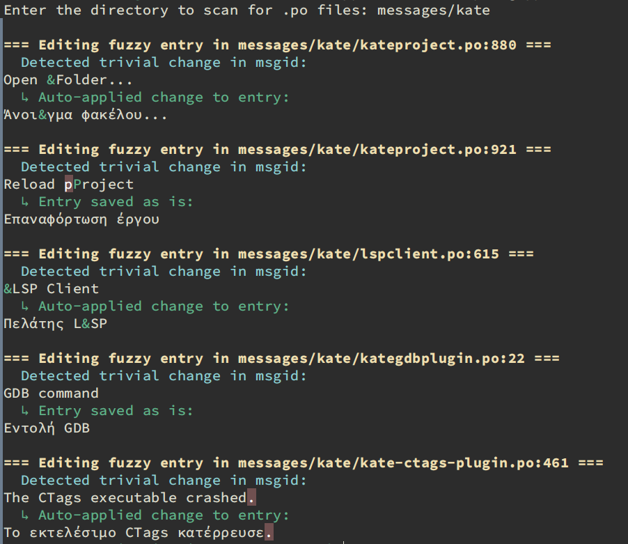

## Translation Assistance Tools:
### Fuzzy Message Repair Tool

This Python script helps improve the quality of translated content
by addressing messages marked as "fuzzy" in translation files.
It offers several automated fixes:

1. Intelligent ampersand insertion:

   Adds ampersand characters for keyboard shortcuts, using the target
   language's letter frequencies as a guide.

2. Case adjustment:

   Modifies capitalization to match the source text more closely.

3. Punctuation refinement:

   Performs simple substitutions, such as replacing "..." with "…"
   for improved typography.

By automating these common adjustments, this tool streamlines the
translation review process and enhances overall text consistency.



### Fuzzy Editor Tool

A new editor tool has been added that allows for interactive processing
of the .po files.

## Installation

### Prerequisites

- Python 3.x
- pip (Python's package installer)

### Steps

1. **Clone the repository:**

   ```sh
   git clone https://github.com/planetis/fix_fuzzy.git
   cd fix_fuzzy
   ```

2. **Create and activate a virtual environment:**

   ```sh
   python -m venv venv
   ```

   - On Windows:
     ```sh
     venv\Scripts\activate
     ```
   - On macOS and Linux:
     ```sh
     source venv/bin/activate
     ```

3. **Install the dependencies:**

   ```sh
   pip install -r requirements.txt
   ```

## Usage

```sh
python fuzzy_repair_tool.py /path/to/directory

python fyzzy_editor.py /path/to/directory
```
