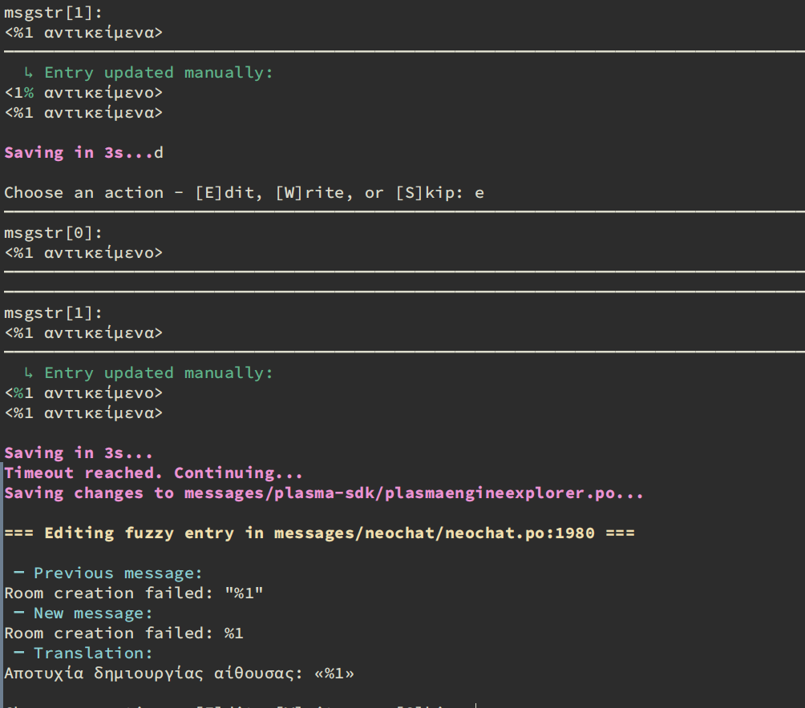

## Translation Assistance Tools
### Fuzzy Message Repair Tool

This Python script helps improve the quality of translated content
by addressing messages marked as "fuzzy" in translation files.
It offers several automated fixes:

1. Intelligent ampersand insertion:

   Adds ampersand characters for keyboard shortcuts, using the target
   language's letter frequencies as a guide.

2. Case adjustment:

   Modifies capitalization to match the source text more closely.

3. Punctuation refinement:

   Performs simple substitutions, such as replacing "..." with "…"
   for improved typography.

By automating these common adjustments, this tool streamlines the
translation review process and enhances overall text consistency.


### Fuzzy Editor Tool

A new editor tool has been added that allows for interactive processing
of the .po files.

## Installation



### Prerequisites

- Python 3.x
- pip (Python's package installer)

### Steps

1. **Clone the repository:**

   ```sh
   git clone https://github.com/planetis/fix_fuzzy.git
   cd fix_fuzzy
   ```

2. **Create and activate a virtual environment:**

   ```sh
   python -m venv venv
   ```

   - On Windows:
     ```sh
     venv\Scripts\activate
     ```
   - On macOS and Linux:
     ```sh
     source venv/bin/activate
     ```

3. **Install the dependencies:**

   ```sh
   pip install -r requirements.txt
   ```

## Usage
### Repair Tool

The Repair Tool automatically fixes fuzzy entries and saves the results.

```sh
python fuzzy_repair_tool.py /path/to/directory
```

### Editor

The Editor allows you to manually review and edit fuzzy entries.

```sh
python fuzzy_editor.py /path/to/directory [options]
```

#### Options:

- `--filter-type`: Choose the filtering method
  - `whitespace_punctuation`: Filter based on whitespace and punctuation
  - `character_difference`: Filter based on character differences
- `--no-filter`: Disable filtering
- `--max-char-diff N`: Set maximum character difference (default: 2)

#### Editor Interface:

When using the Editor, you'll see the currently selected fuzzy entry and the following options:

- `[E]dit`: Edit the current entry
- `[W]rite`: Save changes and move to the next entry
- `[S]kip`: Skip the current entry without changes

#### Editing Notes:

- Press Enter to add a newline
- Press Ctrl+E to open the system's default editor ($EDITOR)
- Press Esc and then Enter to save the current change and continue to the next entry
- Press Ctrl+C at any time to exit the program, saving current progress
